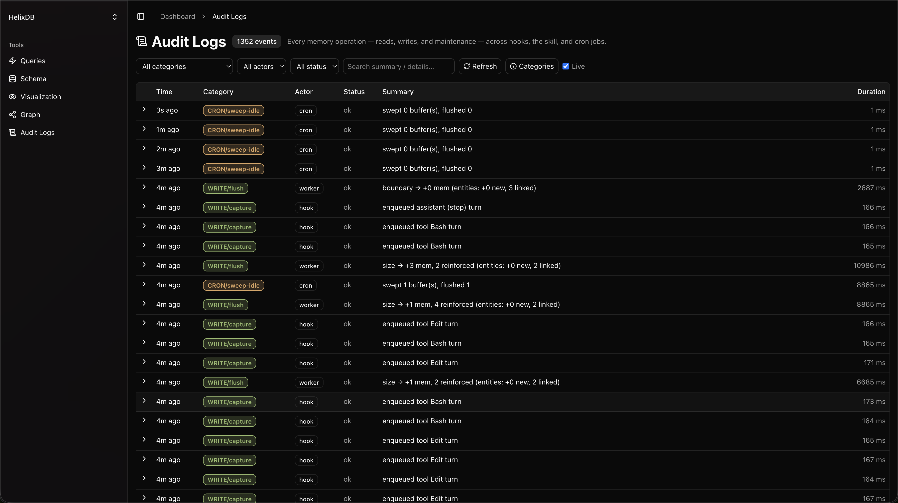
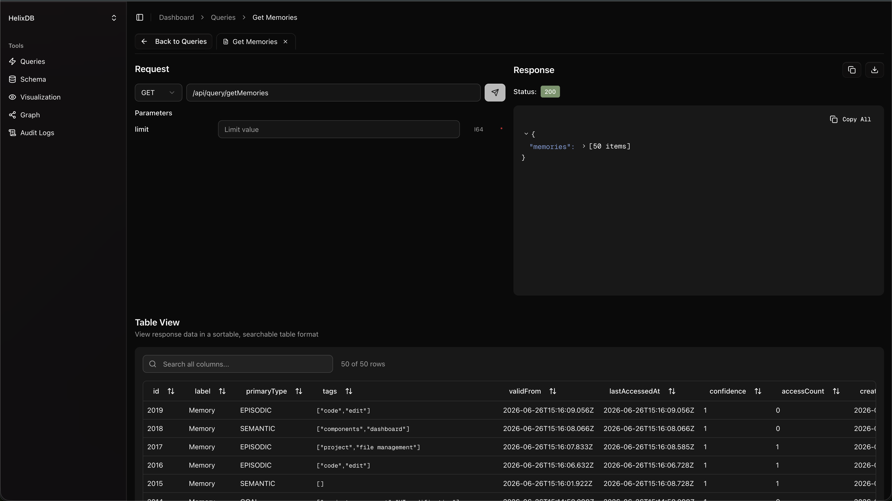
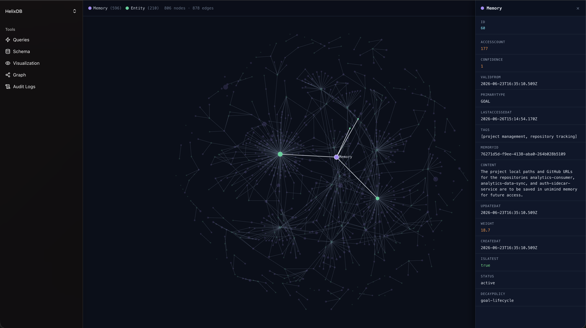

# UniMind

A unified memory platform that ingests, processes, and visualizes data through an intelligent graph-based architecture.

## What is UniMind?

UniMind is a full-stack application that combines graph databases, vector search, and AI-powered workflows to build a comprehensive memory system. It enables you to:

- **Ingest** data from various sources
- **Process** information with AI (powered by OpenAI)
- **Store** as a knowledge graph with semantic relationships
- **Query** using Helix's graph, vector, and full-text search capabilities
- **Visualize** data in an interactive dashboard

## Architecture

UniMind is composed of several key components:

- **HelixDB** — Graph, vector, and full-text search memory store with on-disk persistence via MinIO
- **iii Engine** — Orchestration backbone for queues, functions, and cron jobs
- **UniMind Worker** — Write pipeline, maintenance crons, and audit logging
- **Dashboard** — Next.js web UI for schema exploration, queries, and graph visualization
- **MCP Server** — Model Context Protocol server for Claude integration

## Quick Start

### Prerequisites
- Docker & Docker Compose
- `OPENAI_API_KEY` in `.env` (already set up)
- Node.js 20+ (for local development)

### Setup

To set up your development environment, use the `/dev-setup` skill in Claude Code:

```
/dev-setup
```

This will configure your local environment and verify all dependencies.

### Running the Full Stack

All services must be run via Docker Compose:

```bash
docker compose up
```

This starts all required services in order:
1. MinIO (object storage)
2. HelixDB (graph & vector store)
3. iii Engine (orchestration)
4. UniMind Worker (write pipeline & audit log)
5. Dashboard (Next.js UI)

Access the services:
- **Dashboard** → http://localhost:48173
- **HelixDB** → http://localhost:6969
- **iii Console** → http://localhost:3111

## Dashboard Features

The HelixDB Dashboard provides:

- **Queries** — Run Helix queries with an intuitive builder and live results
- **Schema** — Browse nodes, vectors, and relationships
- **Graph** — Visualize your data as an interactive force-directed graph
- **Audit Logs** — Track all write operations with timestamps and context

## Project Structure

```
unimind/
├── src/
│   ├── audit/          # Audit log system
│   ├── db/             # Database adapters & bootstrap
│   ├── hooks/          # Ingestion hooks & triggers
│   ├── iii/            # iii engine configuration
│   ├── llm/            # OpenAI integration
│   ├── maintain/       # Maintenance crons
│   ├── match/          # Entity matching logic
│   ├── mcp/            # Model Context Protocol server
│   ├── read/           # Query builders
│   └── write/          # Write pipeline & ingestion
├── unimind-dashboard/  # Next.js dashboard
├── docker/             # Docker build configs
├── docs/               # Architecture documentation
└── screenshots/        # UI screenshots
```

## Documentation

- **[ARCHITECTURE.md](./docs/ARCHITECTURE.md)** — Detailed system design and data flow
- **[AGENTS.md](./AGENTS.md)** — Custom Claude agents for UniMind tasks

## Screenshots

See the dashboard in action:

## Audit Log


## Query Builder


## Graph View


## License

Proprietary — UniMind Project
